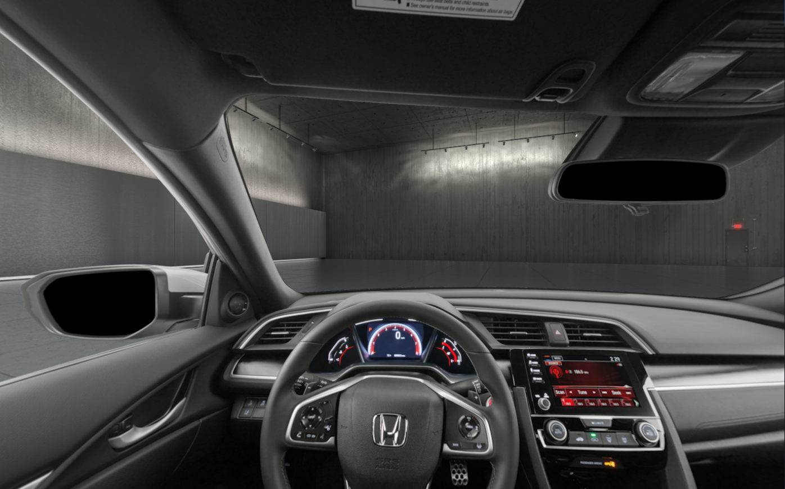
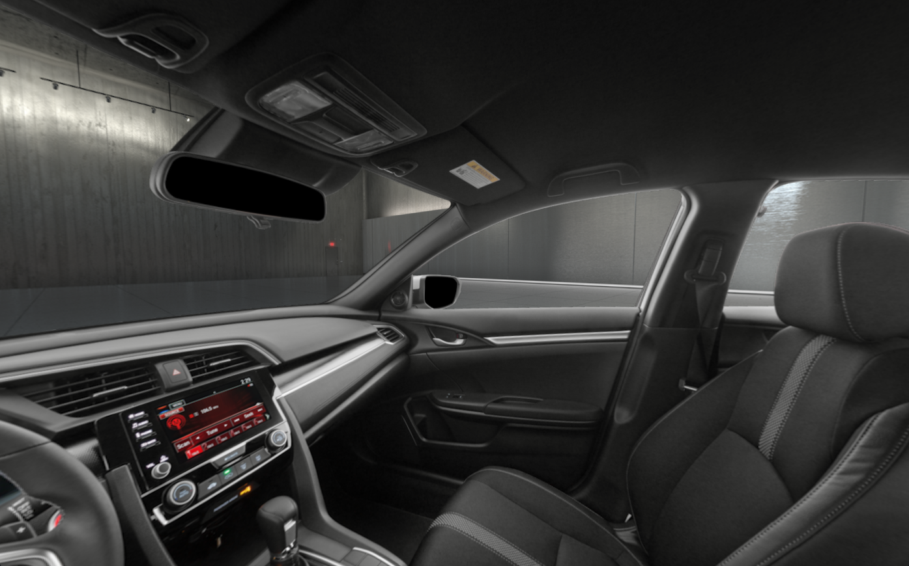
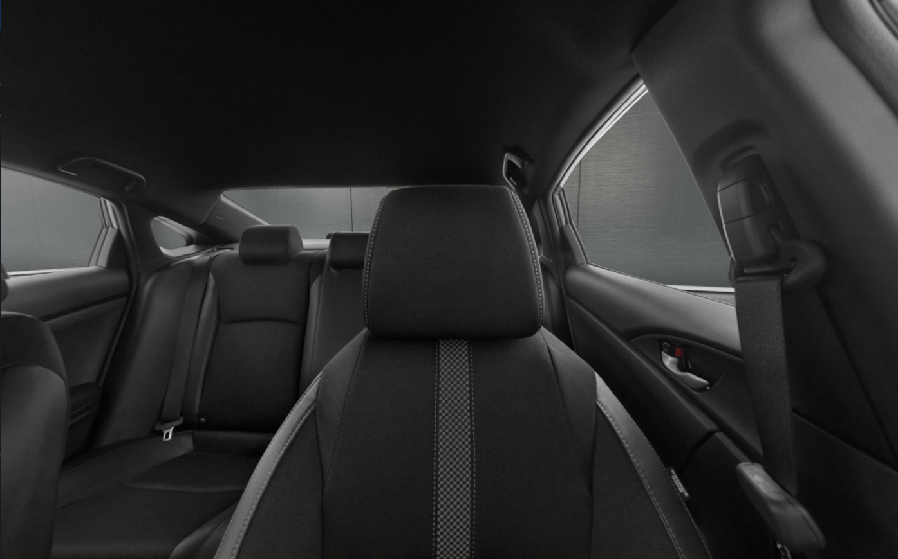

## aframe-custom-cubemap-component

A Custom Cubemap component to load Evox Images interior vehicle assets

For [A-Frame](https://aframe.io).

  - [API](#api)
  - [Installation](#installation)
    - [Browser](#browser)
  - [Usage](#usage)
    - [Locally hosted images](#locally-hosted-images)
    - [API fetched images](#api-fetched-images)
### API

| Property    | Description                                          | Default Value | Options             |
| ----------- | ---------------------------------------------------- | ------------- | ------------------- |
| folder      | Path to local asset folder                           | ' '           |                     |
| edgeLength  | Controls the dimensions of the skybox                | 500           |                     |
| ext         | The image extension                                  | png           | jpg / png           |
| transparent | Toggle transparency for png                          | false         | true / false        |
| stereo      | Controls the layer on which the image is rendered.   | both          | both / left / right |
| eye         | Fetch either left or right eye asset (*API use only) | \_L_          | \_L_  / \_R_        |
| vifnim      | Vehicle vifnum *API use only                         | none          |                     |
| key         | API key *API use only                                | none          |                     |
| background  | Set as true if cubemap is used for background        | false         |                     |

### Installation

#### Browser

Install and use by directly including the [browser files](dist):

### Usage

#### Locally hosted images
```html
<head>
  <title>My A-Frame Scene</title>
  <script src="https://aframe.io/releases/0.9.0/aframe.min.js"></script>
  <script src="aframe-custom-cubemap-component.min.js"></script>
</head>

<body>
   <a-scene rotation="0 180 0" vr-mode-ui="enabled: true">
    <!-- USING LOCAL ASSETS -->
    <a-entity custom-cubemap="folder:./AIL13225_pavr/AIL13225_pavr;transparent:true;vifnum:13225;stereo:left;eye:_L_"></a-entity> 
    <a-entity custom-cubemap="folder:./AIL13225_pavr/AIL13225_pavr;transparent:true;vifnum:13225;stereo:right;eye:_R_"></a-entity> 
    <!-- SHOWROOM -->
    <a-entity custom-cubemap="folder:showroom_int;background:true;"></a-entity>
  </a-scene>
</body>
```




#### Showroom

```html
   <a-scene rotation="0 180 0" vr-mode-ui="enabled: true">
     ...
    <a-entity custom-cubemap="folder:showroom_int;background:true;"></a-entity>
  </a-scene>
```
*`background:true` is a required parameter on the custom-cubemap component

#### Stereo assets
```html
   <a-scene rotation="0 180 0" vr-mode-ui="enabled: true">
    <a-entity custom-cubemap="folder:./AIL13225_pavr/AIL13225_pavr;transparent:true;vifnum:13225;stereo:left;eye:_L_"></a-entity> 
    <a-entity custom-cubemap="folder:./AIL13225_pavr/AIL13225_pavr;transparent:true;vifnum:13225;stereo:right;eye:_R_"></a-entity> 
    ...
  </a-scene>
```
*`vr-mode-ui="enabled:true"` will enable stereo in VR/cardboard mode.
`stereo:left;`, `eye:_L_`, and `transparent:true;` are required parameters on the custom-cubemap component in order to enable stereo view.

#### API fetched images
```html
<head>
  <title>My A-Frame Scene</title>
  <script src="https://aframe.io/releases/0.8.2/aframe.min.js"></script>
  <script src="aframe-custom-cubemap-component.min.js"></script>
</head>

<body>
  <a-scene rotation="0 180 0" vr-mode-ui="enabled: false"> <!-- Rotate the scene to adjust for a flipped bottom image-->
    <a-entity custom-cubemap="vifnum:12353;key:{api_key};transparent:true;"></a-entity>
  </a-scene>
  
</body>
```


